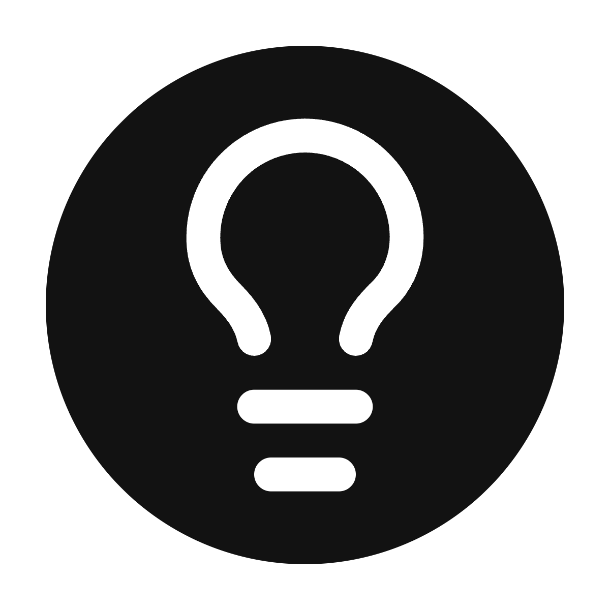
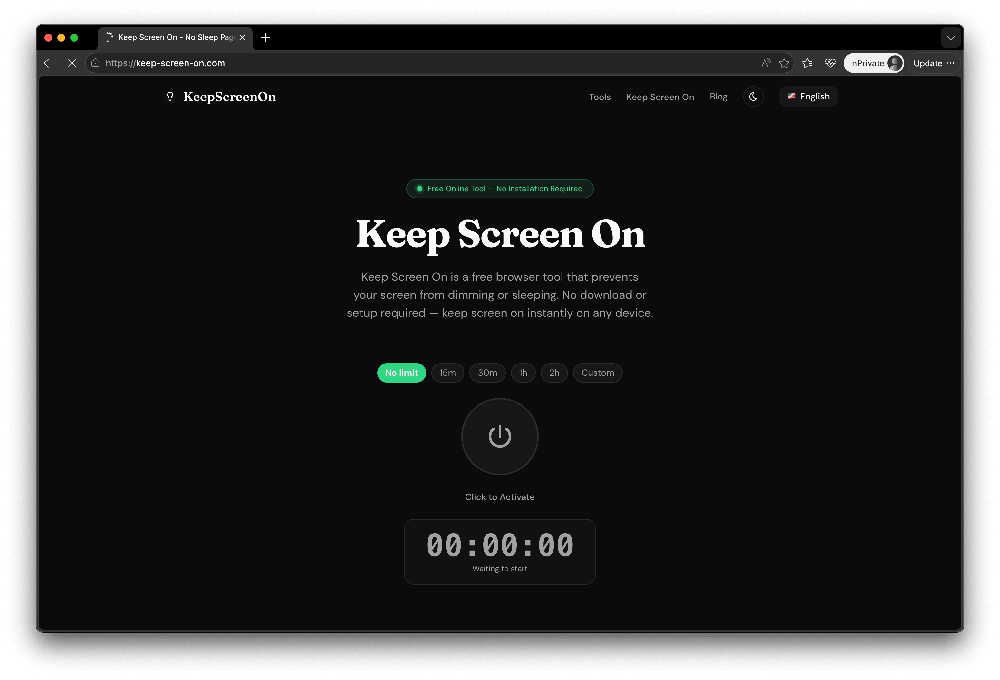

# Keep Screen On

  

<h1 align="center">Keep Screen On</h1>

  A free online tool to keep your screen awake, stop screen sleep, and make
  your display stay on while you read, cook, present, study, navigate, or
  monitor live information.

  <a href="./README.zh-CN.md">简体中文</a>

  <a href="https://keep-screen-on.com">Website</a>
  ·
  <a href="https://keep-screen-on.com/no-sleep-page">No Sleep Page</a>
  ·
  <a href="https://keep-screen-on.com/keep-screen-awake">Keep Screen Awake</a>
  ·
  <a href="https://keep-screen-on.com/screen-always-on">Screen Always On</a>

  
  
  
  

  

## What is Keep Screen On?

**Keep Screen On** is a browser-based no sleep page that helps prevent your
phone, tablet, laptop, or desktop screen from dimming, locking, or going to
sleep during long sessions.

It is designed for moments when you need a display to stay visible without
changing system settings or installing an app. Open the website, turn on the
screen-awake mode, and keep the page active for as long as you need.

## Why Use It?

- **Keep your screen awake instantly** without downloads, extensions, APK files,
  or account setup.
- **Works in a browser** on modern phones, tablets, laptops, and desktop
  computers.
- **Useful across devices** including iPhone, iPad, Android, Samsung Galaxy,
  Windows laptops, MacBooks, Chromebooks, and desktop monitors.
- **Simple for everyday tasks** such as reading, cooking, studying,
  presentations, dashboards, downloads, maps, and video lessons.
- **Privacy-friendly experience** because the keep-awake action runs in the
  browser and does not require personal information.

## Popular Ways to Use Keep Screen On

### No Sleep Page

Use the [No Sleep Page](https://keep-screen-on.com/no-sleep-page) when you want
a simple page that stops your screen from sleeping while the tab remains open.
It is useful for recipes, notes, online lessons, timers, checklists, and long
articles.

### Keep Screen Awake

Use [Keep Screen Awake](https://keep-screen-on.com/keep-screen-awake) when you
need a reliable browser wake lock for meetings, demos, dashboards, downloads,
build monitors, livestreams, or study sessions.

### Screen Always On

Use [Screen Always On](https://keep-screen-on.com/screen-always-on) when you
want an always-on display setup for monitoring information, following
instructions, running a kiosk-style screen, or keeping a status page visible.

## Device Guides

Keep Screen On includes focused guides for common devices and search needs:

| Guide | Helpful for |
| --- | --- |
| [Keep Screen On iPhone](https://keep-screen-on.com/keep-screen-on-iphone) | Keeping an iPhone or iPad screen awake in the browser |
| [Keep Screen On Windows](https://keep-screen-on.com/keep-screen-on-windows) | Preventing a Windows PC or laptop screen from sleeping |
| [Keep Screen On Samsung](https://keep-screen-on.com/keep-screen-on-samsung) | Keeping Samsung Galaxy phones and tablets awake |
| [Keep Screen On Laptop](https://keep-screen-on.com/keep-screen-on-laptop) | Keeping laptop screens awake on Windows, macOS, or Chromebook |
| [Keep Screen On Website](https://keep-screen-on.com/keep-screen-on-website) | Using a website instead of installing a separate app |
| [Keep Screen On APK](https://keep-screen-on.com/keep-screen-on-apk) | Choosing between an Android APK and an online no sleep tool |
| [Keep Screen On Meaning](https://keep-screen-on.com/keep-screen-on-meaning) | Understanding what keep screen on means and how it works |

## Use Cases

Keep Screen On helps when your screen needs to remain visible without repeated
taps, clicks, or settings changes:

- Reading documentation, articles, e-books, PDFs, or study notes
- Following recipes while cooking
- Keeping workout videos, lesson videos, or tutorials visible
- Presenting slides during meetings, classes, livestreams, or demos
- Watching dashboards, analytics, queues, downloads, or system status pages
- Using GPS navigation or maps
- Keeping a checklist, timer, score board, or reference page open
- Running an always-on monitor for a kiosk, counter, desk, or wall display

## Keywords

Keep Screen On is built around common search needs such as **keep screen on**,
**no sleep page**, **keep screen awake**, **screen always on**,
**prevent screen sleep**, **keep display on**, **keep phone screen awake**,
**keep laptop screen awake**, **keep screen on iPhone**,
**keep screen on Windows**, and **keep screen on Samsung**.

## FAQ

### Is Keep Screen On free?

Yes. Keep Screen On is a free online tool for keeping your screen awake.

### Do I need to install anything?

No. It works directly in the browser without an app, extension, APK, or desktop
software.

### Does it work on mobile devices?

Yes. Keep Screen On is designed for modern mobile browsers on iPhone, iPad,
Android phones, Samsung Galaxy devices, and tablets.

### Does it work on laptops and desktops?

Yes. You can use it on Windows, macOS, Linux, Chromebook, and other desktop
browser environments.

### When should I use a no sleep page?

Use a no sleep page whenever you need your screen to stay visible for a task
that should not be interrupted by auto-lock, dimming, or display sleep.

## Website

Visit [keep-screen-on.com](https://keep-screen-on.com) to use Keep Screen On
online.
